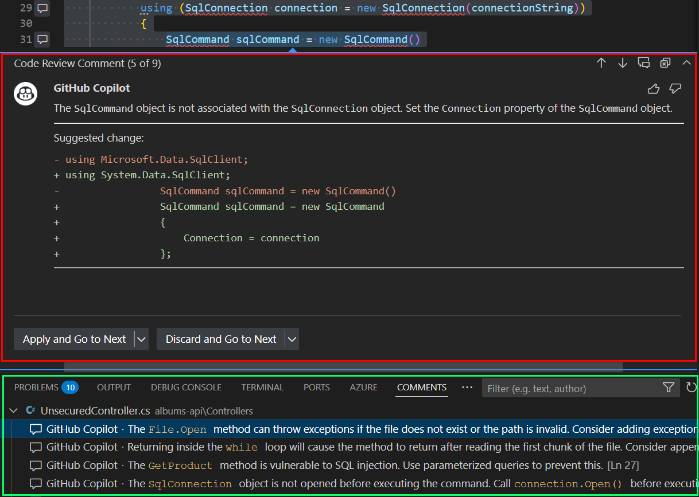

# Session 2: Everyday Developer Tasks

## Overview

This section covers how GitHub Copilot can assist with common everyday developer tasks beyond basic code completion. You'll learn how to leverage Copilot for code explanation, documentation, refactoring, translation, security analysis, and code review.

## Code Explanation and Documentation

You can use Copilot Chat to explain code to you. It can explain you the code in natural language or generate documentation comments for you. Let's try that with the following commands:

```
/explain Generate documentation comments for this code
```

It can be very useful to understand legacy code or code you don't know. Give it a try with files in the legacy folder of the repo.

You can also use Copilot to generate documentation at a high level as it is fluent in markdown. For example, you can ask to complete README.md file (ensure you have the file in the context):

> complete my #file:README.md by adding step to deploy solution on Azure

You can also ask Copilot what are the standard MD files to have in a project on GitHub and generate them for you.

## Code Refactoring

More impressive, Copilot chat can help you refactor your code. It can help you rename variables, extract methods, extract classes, etc....

You can try some of these commands on the `album-api/Controllers/UnsecuredController.cs` file:

> extract methods
> create Async version of each methods when it makes sense

## Secure Your Code

Copilot can help you find security issues in your code and fix them. It can also help you find bad practices in your code and fix them. Let's see how it works.

Open the `album-api/Controllers/UnsecuredController.cs` file and type questions like these to the inline chat:

> Can you check this code for security issues?
> Do you see any quality improvement to do on this code?

Once you have the answer, you can ask to fix the issues by typing:

> Can you propose a fix?

When you have the fix in the code you choose to copy it or inject it directly in the file by hovering the code block in the chat and selecting the right option on the top left.


## Ask Copilot to Review Your Code

You can also ask Copilot to do a review of your code. It will check your code for security issues, bad practices, etc... and generate comments just as a co-worker will do on a pull request. It provides actionable suggestions to improve your code quality and ensure best practices are followed.

This feature can be integrated in different ways depending on your IDE but you should be able to trigger the review on the git changes view for all your changes, or like in the following example just on a single file.

### Review All Your Git Changes

Both VS Code and Visual Studio provide integration with Git changes for code review:

**In VS Code**: Look for the review button (sparkle icon) on the Git changes window in the staged changes section

**In Visual Studio**: You can find the review option in the Git Changes panel with the Copilot integration button (sparkle icon)

*VS  context menu showing Copilot options including "Review and Comment" feature*


### Review on a Single File

Open the `album-api/Controllers/UnsecuredController.cs` file and access the Copilot review feature:

**In VS Code**: Right-click in the code window, and then in the Copilot menu select **"Review and Comment"** option


### Code Review Results

When Copilot performs a code review, you'll see detailed feedback similar to what a colleague would provide:


*Example of Copilot code review showing issue identification and suggested fixes with interactive buttons*

- **Issue Identification**: Copilot identifies problems like "The SqlCommand object is not associated with the SqlConnection object"
- **Suggested Changes**: Provides specific code fixes, such as:
  ```csharp
  - using Microsoft.Data.SqlClient;
  + using System.Data.SqlClient;
  
  SqlCommand sqlCommand = new SqlCommand
  {
      Connection = connection
  };
  ```
- **Interactive Actions**: You can "Apply and Go to Next" or "Discard and Go to Next" for each suggestion
- **Comments Integration**: All comments appear in your IDE's Comments panel for easy tracking

### Multiple Review Comments

The review process can identify multiple issues in a single file:
- **Security vulnerabilities** (e.g., SQL injection risks)
- **Best practices violations** (e.g., proper connection handling)  
- **Code quality improvements** (e.g., exception handling for file operations)
- **Performance optimizations**

Each comment provides context-specific suggestions that you can accept, modify, or dismiss based on your project's requirements.

## Key Takeaways

1. **Code Explanation**: Use `/explain` to understand complex or legacy code
2. **Documentation Generation**: Generate both inline comments and high-level markdown documentation
3. **Refactoring Assistance**: Extract methods, create async versions, and improve code structure
4. **Language Translation**: Convert code between different programming languages
5. **Security Analysis**: Identify and fix security vulnerabilities and code quality issues
6. **Code Review**: Get automated code review suggestions like a colleague would provide

## Commit Changes 


- after reviewing the changes you can use github copilot to generate commit messages for you.Use the pen icon to do so. If you create a new PR from inside VS  you can enable copilot to summarize a commit message on the pr for you as well as show the comments you saw previously inline. 

## Push the commit and create a PR


- after you create the commit go to your PR and enable copilot review of the code. Then get the changes pulled in your IDE and see the inline commments inside your code as well.

---

**Remember**: These everyday tasks showcase Copilot's versatility beyond simple code completion. Use these features to improve code quality, security, and maintainability in your daily development work!
