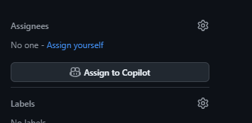
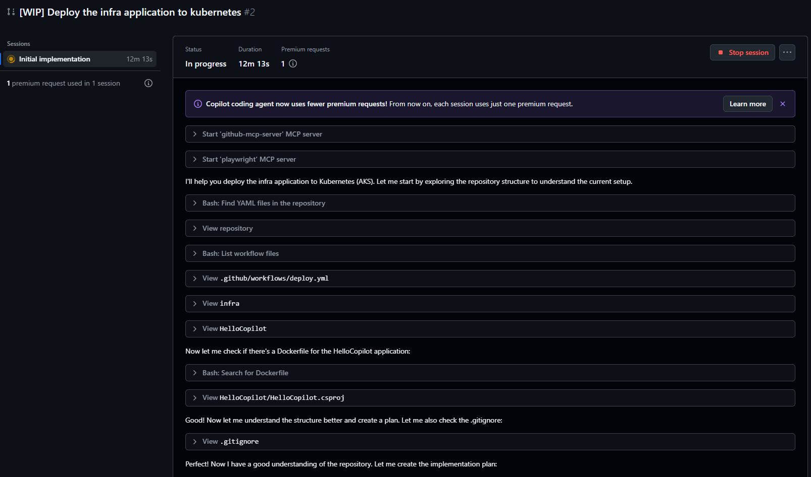

# Session 5: Copilot as Team Mate

## Overview

So far most of the work has been done by you, the developer, with the Copilot coding agent as your assistant. We will now try to use Copilot as a team mate, that can take on tasks and work somewhat independently.

Some of your colleagues prefer to work with AKS, your goal is to re-deploy the application to AKS instead of the hosting platform you used in the previous exercise.

## Step 1: Create Issue Within the Repository

Create an issue within the repository describing the task. Make sure that the new code is created in a new directory called infra-aks. Then ask Copilot to work.

Requirements:
- a new workflow must be created that containerizes the application and deploys it to AKS

## Step 2: Assign the Issue to Copilot

Open the issue, you should see a button called "Assign to Copilot". Click that button.

Now Copilot will create a new pull request, when clicking on it, you will have the option to observe the session.

Now click the view session button.

You will now be able to observe progress:

